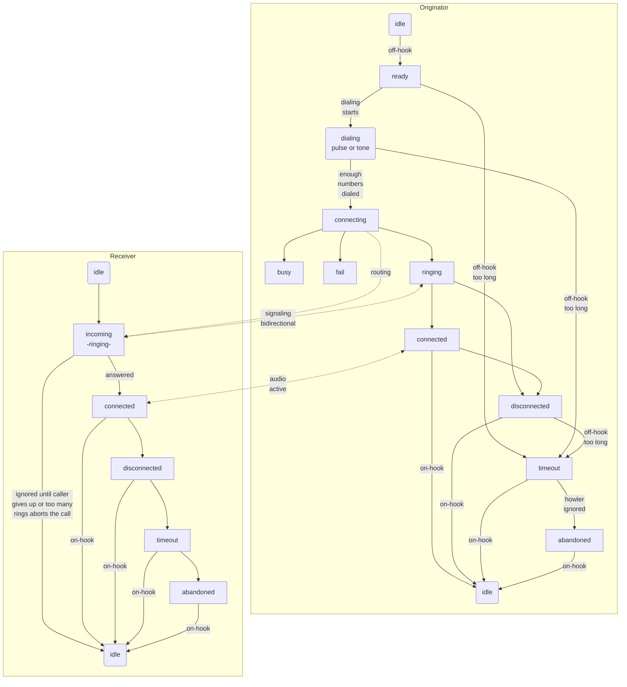

# RetroPhone

>*Work-in-progress*

Free for anyone to copy from. I live by the motto "inspire, not require" as much as I can.

This hobby project is to make a few old phones interactive for my retro room so that visitors can experience old-school landline phones without my having to subscribe to an actual phone system. 

## Goals
* [ ] Dial a few phone numbers and get a simulated response from the "other end"
* [ ] Call one of the other phones on display and talk to whoever answers
* [ ] Accurately replicate a real phone experience
  * [x] physical ringing
  * [x] authentic call progress tones and messages
  * [x] pulse dialing (rotary dialing)
  * [ ] touch-tone dialing (DTMF)

## Optional Goals
* wifi for signaling and comms between phones if ESP32 can handle DAC/ADC simultaneously without noticeable audio problems
* having other devices elsewhere on the Internet and dial them 
  * DIY without using VOIP because if I wanted VOIP [I can buy that for $40](https://a.co/d/4o4eVzs)
* special mode for my old candlestick phone to simulate just picking it up and talking to an operator, possibly with toggling the hook to attract the operator and using a voice assistant to respond to spoken commands
  * if I get that voice assistant idea working, can also use it to respond to dialing zero to get an operator
* status web page, possibly with configurable options
  * could have it run just when on-hook, or maybe only if a special maintenance number is dialed and terminate when phone is hung up again

## Inspiration
* [Telephone Central Office Simulator](https://youtu.be/qM0ZhSyA6Jw) (video) and [related GitHub repo](https://github.com/GadgetReboot/misc_file_bin/tree/master/2022_11/Telephone_Central_Office_wip) from GadgetReboot

## Progress
* button to ESP32 triggers incoming call (physical ringing) with accurate 20Hz ring frequency and 2s-on/4s-off cadence to the SLIC, which rings the phone physically
* stable call progress mode transitions with debounce (hook signal bounces a lot)
  * debounce timing tuned to avoid transitions while pulse-dialing
* real multi-freq progress tones using Mozzi library, using excellent work done by [GadgetReboot](https://youtu.be/qM0ZhSyA6Jw) as a starting point
  * can also play a recorded message (one was included in the code from GadgetReboot)
* pulse dialing detection is working
* added simulated call connection after dialing a number just to hear the ring and busy sounds (sound chosen by even or odd first dialed digit)
* improved audio levels using both software tweaks and increasing gain of op-amp
* implemented DTMF dialing, which works great if I disable dialtone because PhoneDTMF and Mozzi don't play well together (see challenges section)
  * currently using conditional compilation to enable DTMF without dialtone for testing and easily disable when not testing it

## Next Steps
* documentation
  * create a schematic for my circuit
  * add some pictures...I know you want pictures :)
* call progress recorded messages
  * need more recordings
  * need a way to sequence a specified number of repeats with delay between, possibly followed by progress tone (i.e., dial again and howler, although could split timeout into two modes)
* runtime settings adjustable via dialing special codes
  * switching region is one example, and activating the web server until you hang up is another example
  * make the setting persisted so it can survive reboot (but shouldn't survive re-flashing probably)
* DTMF dialing
  * decoded in software if possible (currently have trouble with blocking sample detection affecting mozzi badly)
  * decoded with hardware if software not achievable
* RGB LED for status colors & patterns representing all of the call states
* trunk line via wifi, or wired if wifi affects audio quality
  * could switch to PiZero or something if ESP32 not up to the task with wifi

## Challenges
* Timing of stopping the ringer when handset taken off-hook is difficult to get "immediate", so there is a brief amount of clicking on the handset when first picked up. 
  * I was able to tweak my debounce logic to skip the debounce period when specifically transitioning from incoming to connected (triggered by going off-hook), which has it down to about 100 milliseconds.
    * I tried a few other things in code, like pin-interrupt and trying to detect off-hook state at top of loop, but nothing worked. I think we have effectively eliminated all of the ESP32 delay.
    * Another option might be using hardware and-gate with inverted hook input anded with the ringer output signals, but if the delay is within the SLIC then this won't matter.
  * It seems like the SLIC takes a moment to detect off-hook when the RM pin is high, possibly related to the higher voltage while ringing. I noticed if I leave RM low while ringing the overlap disappears, however we need the RM pin high to actuate a physical bell. 
  * This overlap might be normal, even with a real phone system...just rare for anyone to notice because they don't usually have the earpiece to their ear already when going off-hook. If I find a phone on a real phone system I may try to check this.
* The SLIC's audio output pin has the physical ringing signal while ringing, likely requiring an isolation mechanism (relay, solid-state relay, other options?)
  * `not an issue` ~~if the actual ring voltage is present on the SLIC audio out pin we will need to protect the ESP32 with some form of isolation while ringing~~
  * if we decide to use physical wire for the trunk line we will need to disconnect the SLIC audio out from it while dialing
  * if we decide to use DTMF signaling over the trunk audio line before connecting the call we will have to use a switching mechanism to isolate the trunk line and shift the ESP32 audio out pin to the trunk or use a different DAC pin for it
* tried tone dialing in software but the [PhoneDTMF library](https://github.com/Adrianotiger/phoneDTMF) requires too much sample time and it murders mozzi
  * which is only a problem when trying to detect during dialtone...once detection has started we switch to silence and the detection would be fine
  * maybe we can find a trick to detect tone dialing is occurring and switch off the dialtone before engaging PhoneDTMF?

## Notable
* RM and FR pins on the SLIC are both necessary for rining. The RM pin sets the higher ringing voltage, and the FR pin flip flops the polarity on high and low cycles. Both are definitely needed, although the electronic ringer on my Sony slimline works fine with just FR toggled, the physical bell on the Snoopy phone requires the RM to have enough power to physically move the armature. The FR pin should be toggled at 50% duty cycle at 20Hz with cadence 2s-on/4s-off for US ring.
* When using PhoneDTMF library, we seem to need 300 sample count and 6000 frequency to avoid detection dropouts while a button is pressed (which causes repeated numbers)
  * I tried 50ms debounce and still got gaps, and since 50ms tone and 50ms space are the standard that I saw someplace we probably shouldn't debounce longer

## Thoughts
* would interrupts be useful in this project so we can put the device to sleep when idle, but still wake up for incoming wifi call or off-hook pin?
* I wonder if the whole state machine could be based on interrupts and avoid having a loop entirely?
* should probalby have special response for 911 dialing to clearly say it's not a real phone and cannot be used for emergencies

## Tidbits
* `while (!Serial){}` to wait for serial connection (example was right after Serial.begin() in setup())
* `for (const auto &line : lines){}` enumerate a local array (not pointer to array) [ref](https://luckyresistor.me/2019/07/12/write-less-code-using-the-auto-keyword/)
* `Serial.printf("..%s..", stringvar.c_str())` to print `String` type with printf because `%s` epxects C style string not `String` object and will garble the value or even crash the app
* passing arrays to functions, [good explanation](https://stackoverflow.com/a/19894884/8228356)
  in a nutshell, arg is simple pointer and you pass array directly when calling, but really a pointer to first array value is passed and in the func you can access array values by index like normal...but you can't know the length and must pass that value separately

## Hardware
* [KS0835F SLIC module](https://www.youtube.com/redirect?event=video_description&redir_token=QUFFLUhqbEtxcHQ2MnVEQ3c2ZXVjNHRtZW82Tk1JSS1UUXxBQ3Jtc0ttV0g1ZlFleXBXV0JRbVJTbldEbW12X2JVQ0ZJcEJ0NG44ck94cUtmeEowY2xuNi1QSEQwbzFzYmo1cDdGLTFWNHR4QmpVbS0yNlRvdWFYeEN4b3JUcnFYZnN3SWkwUGRmSmI4UDNFSDE3R1Rlb0Iycw&q=https%3A%2F%2Fs.click.aliexpress.com%2Fe%2F_DFeMKoP&v=qM0ZhSyA6Jw) (AG1171/AG1170 clone)
* ESP32

## Software
* this repository
* [VisualStudio Code](https://code.visualstudio.com/) with [PlatformIO extension](https://platformio.org/?utm_source=platformio&utm_medium=piohome) using Arduino libraries in C++
* [DTMF software decoder](https://github.com/Adrianotiger/phoneDTMF)

## Call Progress Modes
I made this chart to help me track what transitional modes I should implement and what is active during each mode. Work in progress and likely to change as I get deeper into it and discover which assumptions aren't correct. 

`Phone` column represents user experience (interactive elements like handset audio, bell ringer). `MF-` prefix means multi-frequency tone. The `Dialer` detects dialed numbers on local phone, which is not really in the `Trunk` category but I didn't want another column just for the Dialer.

|State|Hook|Trunk|Phone|Notes|
|---|---|---|---|---|
|Idle|ON|LISTEN|Website|&bull; website active for status, statistics & configuration (maybe all the time if not affecting operation)|
|Ready|OFF|Dialer|MF-Dialtone|&bull; switch to Dialing as soon as first number dialed|
|Tone-Dialing|OFF|Dialer||&bull; restart timeout after each dialed number (maybe not necessary; how does real phone system do it?)|
|Pulse-Dialing|OFF|Dialer||&bull; restart timeout after each dialed number (maybe not necessary; how does real phone system do it?)|
|Connecting|OFF|ROUTE||&bull; negotiate connection|
|Busy|OFF||MF-Busy|&bull; start timeout|
|Route Fail|OFF||Recording|&bull; "number not in service" &bull; start timeout|
|Ringing|OFF|LOOP|MF-Ring|&bull; must send signaling to keep route alive &bull; receiving end can optionally disconnect if no answer after custom duration|
|Connected|OFF|AUDIO|Live Audio||
|Disconnected|OFF|||&bull; call audio stream terminated by remote end (ringing or active call) &bull; start timeout in case user fails to hang up|
|Timeout|OFF||Recording, MF-Howler|&bull; left off hook too long unconnected &bull; how long is appropriate for timeout? &bull; "please hang up and try your call again", then play howler|
|Abandoned|OFF|||&bull; gave up waiting for you to hang up, so line is abandoned and services are disabled until back on hook|
|Incoming|ON|LOOP|Physical Ringing|&bull; remote end must send repeated or continuous signal, which abandons ringing if it ends|

## Call Progress Flow
