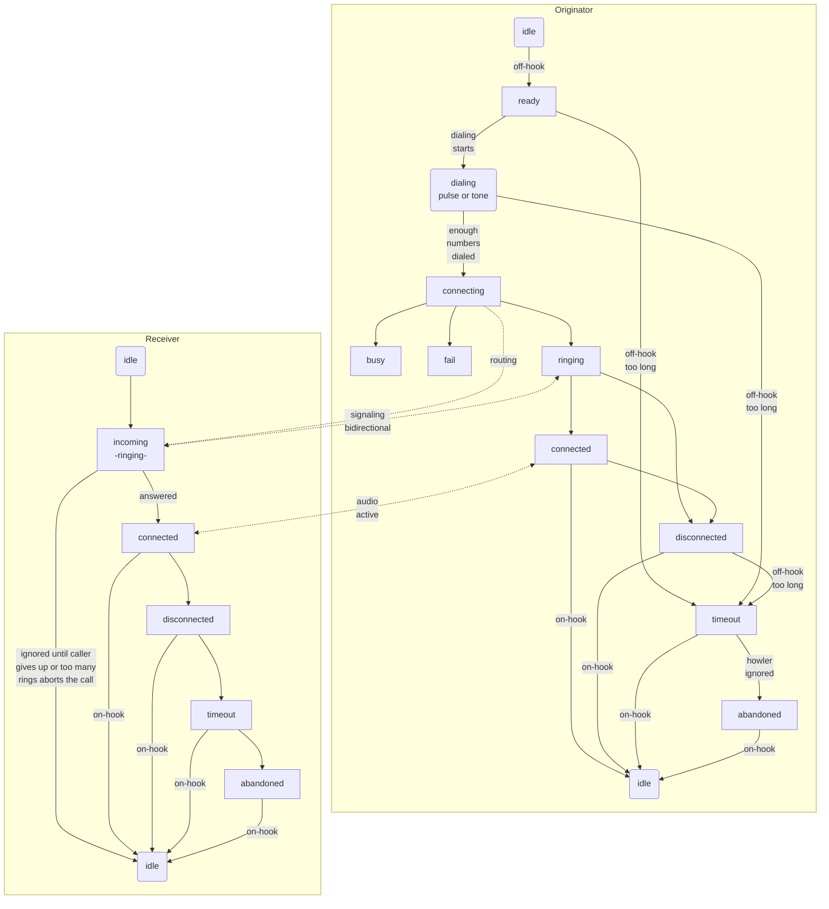

# RetroPhone

>*Work-in-progress*

Free for anyone to copy from. I live by the motto "inspire, not require" as much as I can.

This is a hobby project to make a few old phones interactive for my retro room so that visitors can experience old-school landline phones without having to buy phone service.

There is a lot of info in this README, but also some useful stuff in the [docs folder](docs/README.md) like my schematic and some reference materials. Many of the folders also have their own README file. The [src/README.md](src/README.md) file is a good place to start for the code. 

  
  

## Goals
* [X] Accurately replicate a real phone experience
  * [x] physical ringing
  * [x] call progress tones
  * [x] rotary dialing (pulse dialing)
  * [X] tone dialing (DTMF)
  * [X] automated phone service messages
* [ ] Dial a few phone numbers and get a simulated response from the "other end"
* [ ] Call one of the other phones on display and talk to whoever answers

## Optional Goals
* wifi for signaling and digitized voice between phones
* having other devices elsewhere on the Internet and dial them 
  * DIY without using VOIP because if I wanted VOIP [I can buy that for $40](https://a.co/d/4o4eVzs)
* use a digital voice assistant when dialing operator (like Alexa or Google)
* status web page, possibly with configurable options
  * could have it run just when on-hook, or maybe only if a special maintenance number is dialed and terminate when phone is hung up

## Inspiration & Motivation
* [Telephone Central Office Simulator](https://youtu.be/qM0ZhSyA6Jw) (video) and [related GitHub repo](https://github.com/GadgetReboot/misc_file_bin/tree/master/2022_11/Telephone_Central_Office_wip) from **GadgetReboot**
  >I have a great appreciation for GadgetReboot's willingness to collaborate on our similar projects. He graciously filled in a lot of gaps I had on the hardware side, and I still have much to learn. My military electronics training is about 25 years stale now and I never had the benefit of practical engineering of electronic circuits... all theory and no substance once could say.
* I got my first ESP32 many months ago and it's been sitting patiently on my workbench waiting for me to get around to it. I never even did a flashing LED demo...leave it to me to start out with something complicated!
* I've been wanting to get back into tinkering with electronics for many, many years. My software career has been great, but I still have that longing to build stuff with real parts. I've loved both computer programming and electronics since I first discovered them as a child...ESP32 is a great way to do both!
* I like old phones and I've started to grow a small collection. Why not make them do something?
* This project has a special connection to a childhood memory. When I was around 12 years old I experimented with the house phone line by putting a speaker on it and hearing a dialtone. I was fascinated, and learned how to dial it by making and breaking the connection rapidly to call a friend and discovered he could hear me if I shouted into the speaker. I took a few old phones apart to study their innards and learned a few more things about them in the process. My parents never knew about that, of course! 

## Currently Functional
* physical ringing for incoming call, currently triggered by a button
* real call progress tones and system messages
  * configurable for North America or United Kingdom sounds
  * mp3 playback for system messages
  * playback sequencing of tones and slices of mp3 files to build a full message (like reading out the number you dialed during `not in service` error message)
* tone and pulse dialing
* configuration by dialing star-codes (or 22 instead of * when pulse dialing)
* dialing any 7-digit number will play appropriate audio for ring, busy or error depending on first digit (temporary demo until I have calls working between devices)
* RGB LED for status colors & patterns representing all of the call states

## Next Steps
* add filter to block 20Hz ring signal from SLIC's audio out line (mostly to keep it off my external speaker when it's ringing)
* trunk line via wifi, or wired if wifi affects audio quality
  * could switch to PiZeroW or something if simultaneious ADC/DAC/Wifi is too much for ESP32
  * might be an option to design these modules for a backplane in a single housing and just use wiring between the modules for analog audio (think of it like a local switching office)

## Challenges
* high voltage ring signal overlaps going off-hook slightly
  * minimized to about 100ms by skipping debounce of SHK
  * appears to be a circuit delay in the SLIC detecting off-hook while ringing
  * might be normal; need to test a real phone line
* The SLIC's audio output pin has the 20Hz ringing signal while ringing (at audio level, not high voltage), likely requiring a filter or an isolation mechanism (relay, solid-state relay, other options?)
* software-DTMF with [PhoneDTMF library](https://github.com/Adrianotiger/phoneDTMF) requires too much sample time in the main loop and it murders Mozzi so it requires not using dialtone, and I had repeating digit issues during steady tone presses
  * While trying a new strategy to generate call progress tones I found that PhoneDTMF doesn't murder the new dialtone. It doesn't hear the DTMF tone sometimes, but seems to get it most of the time. The new call progress tone techique uses I2S to the local DAC like Mozzi, but runs as a FreeRTOS task feeding a buffer with multiple samples at a time instead of a single sample during each main loop iteration. 
  * I wonder if PhoneDTMF could run as a task with FreeRTOS and have better results?
* Using Preferences.h to save settings was hanging on the prefs.begin() call at startup. I couldn't find anyone else online having this issue, but I eventually figured out it was a timing issue of some sort. A short delay before calling prefs.begin() was needed. A 50ms delay seems sufficient. I occasionally saw hangs when reading values during startup(), so if you see that try increasing the delay. 
* stopping dialtone fast enough to not hear a blip of it after dialing `1` as first digit required some special handling
  * primarily affects mechanical rotary dial phone; my electronic slimline phone mutes line audio long enough that it wasn't an issue
  * added special callback to stop dialtone on very first instant of SHK falling edge without waiting for debounce
  * dialing-started callback must wait for rising edge to avoid dialing mode change on hangup
  * reduced tone generation chunk size from 576 to 33 (17ms to 1ms) so audio task loop detects cancellation faster and less audio in the buffer to finish playing
  * I wonder if the original POTS system had that issue too?
* I2S with the internal DAC on the ESP32 has a quirk with popping when I2S first starts due to the pin level being 0V or floating at some non-midpoint value and suddenly jumping to the midpoint value (the zero-signal level). 
  * This is partly solvable by initializing the pin with a ramp signal before starting I2S, except for the case where the pin level is floating rather than 0V so we can't predict the starting level to ramp from and our ramp causes a popping sound. We might be able to solve that with a pulldown resistor on the pin, maybe 100K. I need to test this. 
  * This isn't much of a real problem since the user is unlikely to have the handset to their ear at startup. I only notice it when I have my external speaker hooked up while testing
* The SLIC audio output has a popping sound when the ESP32 restarts. I haven't yet determined if it's a power supply issue since we are powering 3V3 from the ESP32 board. 
  * Just like the I2S popping at startup, this isn't much of a problem during normal operation. 

## Notable
* SHK pin from SLIC bounces a lot, so it requires debounce logic. 
  * GadgetReboot noticed it bounces longer when powered 3.3V vs. 5V
* RM and FR pins on the SLIC are both necessary for ringing. The RM pin sets the higher ringing voltage, and the FR pin flip flops the polarity on high and low cycles. Both are definitely needed, although the electronic ringer on my Sony slimline works fine with just FR toggled, the physical bell on the Snoopy phone requires the RM to have enough power to physically move the armature. The FR pin should be toggled at 50% duty cycle at 20Hz with cadence 2s-on/4s-off for US ring.
* When using PhoneDTMF library, we seem to need 300 sample count and 6000 frequency to avoid detection dropouts while a button is pressed (which causes repeated numbers)
  * I tried 50ms debounce and still got gaps, and since 50ms tone and 50ms space are the standard that I saw someplace we probably shouldn't debounce longer
  * Update: I have since found a bug in my coordination of PhoneDTMF that resolved the debounce issue without needing a debounce.
* The [missing fundamental](https://blogs.scientificamerican.com/roots-of-unity/your-telephone-is-lying-to-you-about-sounds/) phenomenon is really interesting. Although phones only use frequencies 300Hz to 3400Hz, we actually hear lower tones due to this phenomenon.

## Thoughts
* would interrupts be useful in this project so we can put the device to sleep when idle, but still wake up for incoming wifi call or off-hook pin?
* special response for 911 dialing to clearly say it's not a real phone and cannot be used for emergencies
* digitizing settings can be fairly low because a real phone system caps the upper frequency at 3400 Hz
* could use an IO pin to control power to the hardware DTMF decoder and level shifter to reduce power consumption, but only if I want to run on a battery
* PhoneDTMF software decoding might run better as a FreeRTOS task... needs experimentation

## C++ Tidbits
Although I'm a seasoned software engineer, I'm new to C++ so I've got some notes others may find helpful.
* `for (const auto &line : lines){}` enumerate a local array (not pointer to array) [ref](https://luckyresistor.me/2019/07/12/write-less-code-using-the-auto-keyword/)
* `Serial.printf("..%s..", stringvar.c_str())` to print `String` type with printf because `%s` epxects C style string not `String` object and will garble the value or even crash the app
* passing arrays to functions, [good explanation](https://stackoverflow.com/a/19894884/8228356)

  In a nutshell, arg is simple pointer and you pass array directly when calling, but really a pointer to first array value is passed and in the func you can access array values by index like normal...but you can't know the length and must pass that value separately.

## Hardware
* [KS0835F SLIC module](https://www.youtube.com/redirect?event=video_description&redir_token=QUFFLUhqbEtxcHQ2MnVEQ3c2ZXVjNHRtZW82Tk1JSS1UUXxBQ3Jtc0ttV0g1ZlFleXBXV0JRbVJTbldEbW12X2JVQ0ZJcEJ0NG44ck94cUtmeEowY2xuNi1QSEQwbzFzYmo1cDdGLTFWNHR4QmpVbS0yNlRvdWFYeEN4b3JUcnFYZnN3SWkwUGRmSmI4UDNFSDE3R1Rlb0Iycw&q=https%3A%2F%2Fs.click.aliexpress.com%2Fe%2F_DFeMKoP&v=qM0ZhSyA6Jw) (AG1171/AG1170 clone)
* [ESP32 Freenove WROVER CAM board](https://www.amazon.com/ESP32-WROVER-Contained-Compatible-Bluetooth-Tutorials/dp/B09BC1N9LL) 
  * not using camera for this project, but the power & GPIO breakout adapter is really handy
* [MT8870 module](https://microcontrollerslab.com/mt8870-dtmf-decoder-module-pinout-interfacing-with-arduino-features/) (DTMF decoder)
* [Level Shifter](https://www.pololu.com/product/2595)
* [LM358P op-amp](https://www.mouser.com/ProductDetail/Texas-Instruments/LM358P?qs=X1HXWTtiZ0QtOTT8%252BVnsyw%3D%3D)
* [WS2812S module](https://a.co/d/4Lo5N9y) (addressable RGB LED)

## Software
* [VisualStudio Code](https://code.visualstudio.com/) with [PlatformIO extension](https://platformio.org/?utm_source=platformio&utm_medium=piohome) using Arduino libraries in C++
* [DTMF software decoder](https://github.com/Adrianotiger/phoneDTMF) (shelved as unreliable; now using hardware decoder)
* [Mozzi](https://sensorium.github.io/Mozzi/) for call progres tone generation (mostly abandoned, but still using tone oscillator)
* [FastLED](https://github.com/FastLED/FastLED) to run the addressable RGB LED
* [ESP32 MP3 Player](https://github.com/atomic14/esp32-play-mp3-demo) to play mp3 system messages and call progress tones (heavily modified)
* [minimp3.h](https://github.com/lieff/minimp3) to decode mp3 files

## Call Progress Modes
I made this chart to help me track what transitional modes I should implement and what is active during each mode. Work in progress and likely to change as I get deeper into it and discover which assumptions aren't correct. 

`Phone` column represents user experience (interactive elements like handset audio, bell ringer). `MF-` prefix means multi-frequency tone. The `Dialer` detects dialed numbers on local phone, which is not really in the `Trunk` category but I didn't want another column just for the Dialer.

|State|Hook|Trunk|Phone|Notes|
|---|---|---|---|---|
|Idle|ON|LISTEN|Website|&bull; website active for status, statistics & configuration (maybe all the time if not affecting operation)|
|Ready|OFF|Dialer|MF-Dialtone|&bull; switch to Dialing as soon as first number dialed|
|Tone-Dialing|OFF|Dialer||&bull; restart timeout after each dialed number (maybe not necessary; how does real phone system do it?)|
|Pulse-Dialing|OFF|Dialer||&bull; restart timeout after each dialed number (maybe not necessary; how does real phone system do it?)|
|Connecting|OFF|ROUTE||&bull; negotiate connection|
|Busy|OFF||MF-Busy|&bull; start timeout|
|Route Fail|OFF||Recording|&bull; "number not in service" &bull; start timeout|
|Ringing|OFF|LOOP|MF-Ring|&bull; must send signaling to keep route alive &bull; receiving end can optionally disconnect if no answer after custom duration|
|Connected|OFF|AUDIO|Live Audio||
|Disconnected|OFF|||&bull; call audio stream terminated by remote end (ringing or active call) &bull; start timeout in case user fails to hang up|
|Timeout|OFF||Recording, MF-Howler|&bull; left off hook too long unconnected &bull; how long is appropriate for timeout? &bull; "please hang up and try your call again", then play howler|
|Abandoned|OFF|||&bull; gave up waiting for you to hang up, so line is abandoned and services are disabled until back on hook|
|Incoming|ON|LOOP|Physical Ringing|&bull; remote end must send repeated or continuous signal, which abandons ringing if it ends|

## Call Progress Flow
