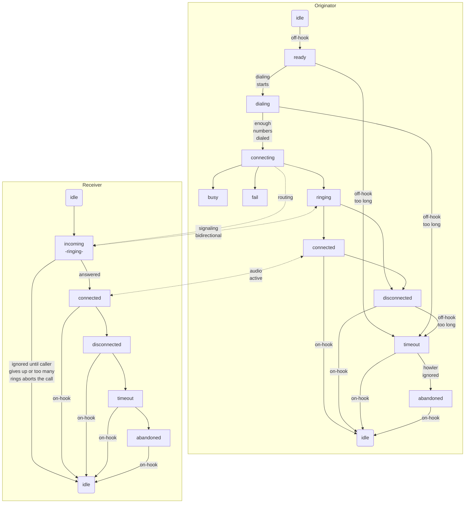

# RetroPhone

>*Work-in-progress*

Free for anyone to copy from. I live by the motto "inspire, not require" as much as I can.

This hobby project is to make a few old phones interactive for my retro room so that visitors can experience old-school landline phones without my having to subscribe to an actual phone system. 

## Goals
* Dial a few phone numbers and get a simulated response from the "other end"
* Call one of the other phones on display and talk to whoever answers
* Accurately replicate a real phone experience
  * physical ringing
  * authentic call progress tones and messages
  * touch-tone dialing (DTMF)
  * pulse dialing (rotary dialing)

## Optional Goals
* wifi for signaling and comms between phones if ESP32 can handle DAC/ADC simultaneously without noticeable audio problems
* having other devices elsewhere on the Internet and dial them 
  * DIY without using VOIP because if I wanted VOIP [I can buy that for $40](https://a.co/d/4o4eVzs)
* special mode for my old candlestick phone to simulate just picking it up and talking to an operator, possibly with toggling the hook to attract the operator and using a voice assistant to respond to spoken commands
  * if I get that voice assistant idea working, can also use it to respond to dialing zero to get an operator
* status web page, possibly with configurable options

## Progress
* button to ESP32 triggers incoming call (physical ringing) with accurate 20Hz ring frequency and 2s-on/4s-off cadence to the SLIC, which rings the phone physically
* stable call progress mode transitions with debounce (hook signal bounces a lot)
  * debounce timing tuned to avoid transitions while pulse-dialing
* fake call progress tones with optional on/off cadence timing 
  * single-freq on PWM pin for now until I implement multi-freq on DAC pin

## Challenges
* Timing of stopping the ringer when handset taken off-hook is difficult to get "immediate", so there is a brief amount of clicking on the handset when first picked up. 
  * I was able to tweak my debounce logic to skip the debounce period when specifically transitioning from incoming to connected (triggered by going off-hook), which has minimized to probably about 50 milliseconds.
* The SLIC's audio output pin has the physical ringing signal while ringing, likely requiring an isolation mechanism (relay, solid-state relay, other options?)
  * if the actual ring voltage is present on the SLIC audio out pin we will need to protect the ESP32 with some form of isolation while ringing
  * if we decide to use physical wire for the trunk line we will need to disconnect the SLIC audio out from it while dialing
  * if we decide to use DTMF signaling over the trunk audio line before connecting the call we will have to use a switching mechanism to isolate the trunk line and shift the ESP32 audio out pin to the trunk or use a different DAC pin for it

## Next Steps
* pulse dialing, decoded in software
* DTMF dialing, decoded in software
* multi-freq call progress tones on DAC pin
* call progress recorded messages
* trunk line via wifi, or wired if wifi affects audio quality
  * could switch to PiZero or something if ESP32 not up to the task with wifi

## Inspiration
* [Telephone Central Office Simulator](https://youtu.be/qM0ZhSyA6Jw) (video) and [related GitHub repo](https://github.com/GadgetReboot/misc_file_bin/tree/master/2022_11/Telephone_Central_Office_wip) from GadgetReboot

## Hardware
* [KS0835F SLIC module](https://www.youtube.com/redirect?event=video_description&redir_token=QUFFLUhqbEtxcHQ2MnVEQ3c2ZXVjNHRtZW82Tk1JSS1UUXxBQ3Jtc0ttV0g1ZlFleXBXV0JRbVJTbldEbW12X2JVQ0ZJcEJ0NG44ck94cUtmeEowY2xuNi1QSEQwbzFzYmo1cDdGLTFWNHR4QmpVbS0yNlRvdWFYeEN4b3JUcnFYZnN3SWkwUGRmSmI4UDNFSDE3R1Rlb0Iycw&q=https%3A%2F%2Fs.click.aliexpress.com%2Fe%2F_DFeMKoP&v=qM0ZhSyA6Jw) (AG1171/AG1170 clone)
* ESP32

## Software
* this repository
* [VisualStudio Code](https://code.visualstudio.com/) with [PlatformIO extension](https://platformio.org/?utm_source=platformio&utm_medium=piohome) using Arduino libraries in C++
* [DTMF software decoder](https://github.com/Adrianotiger/phoneDTMF)

## Call Progress Modes
I made this chart to help me track what transitional modes I should implement and what is active during each mode. Work in progress and likely to change as I get deeper into it and discover my assumptions weren't correct.

 **State**        | **Hook** | **Trunk/WiFi** | **DTMF/Pulse** | **Audio**           | **Ringer** | **Website** | **Notes**                                                                                               
------------------|----------|----------------|----------------|---------------------|------------|-------------|---------------------------------------------------------------------------------------------------------
 **Idle**         | ON       | LISTEN         | -              | -                   | -          | ON          | • website active for status, statistics & configuration
 **Ready**        | OFF      | -              | LISTENING      | Dialtone            | -          | -           | • switch to Dialing as soon as first number dialed
 **Dialing**      | OFF      | -              | LISTENING      | -                   | -          | -           | • restart timeout after each dialed number (maybe unnecessary)
 **Connecting**   | OFF      | ROUTE          | -              | -                   | -          | -           | • negotiate connection
 **Busy**         | OFF      | -              | -              | Busy                | -          | -           | • start timeout
 **Route Fail**   | OFF      | -              | -              | Message             | -          | -           | • "number not in service"  &bull; start timeout
 **Ringing**      | OFF      | SIGNALING      | -              | Stream              | -          | -           | • must send signaling to keep route alive &bull; receiving end can optionally disconnect if no answer after custom duration
 **Connected**    | OFF      | AUDIO          | -              | Stream              | -          | -           | 
 **Disconnected** | OFF      | -              | -              | -                   | -          | -           | • call audio stream terminated by remote end (ringing or active call) &bull; start timeout in case user fails to hang up
 **Timeout**      | OFF      | -              | -              | Message,            | -          | -           | • left off hook too long unconnected &bull; how long is appropriate for timeout? &bull; "please hang up and try your call again", then play howler
 **Abandoned**    | OFF      | -              | -              | -                   | -          | -           | • gave up waiting for you to hang up, so line is abandoned and services are disabled until back on hook
 **Incoming**     | ON       | SIGNALING      | -              | -                   | Ringing    | -           | • origin end must send repeated or continuous signal to keep route alive; abort call if signaling ends

## Call Progress Flow
