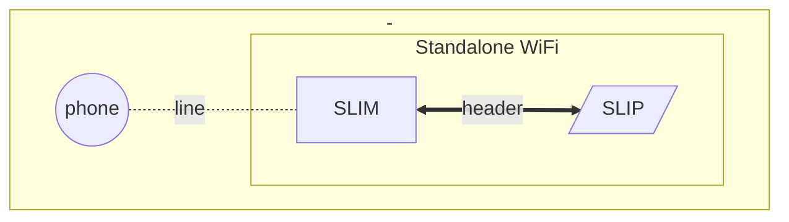
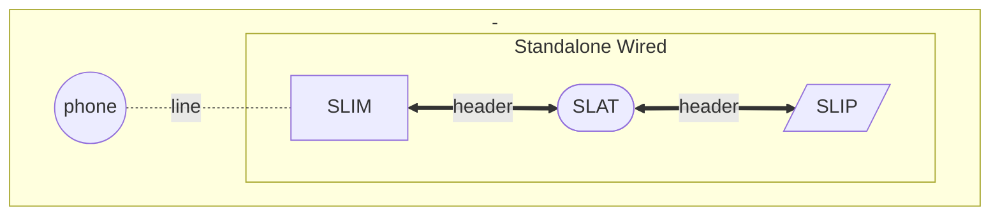
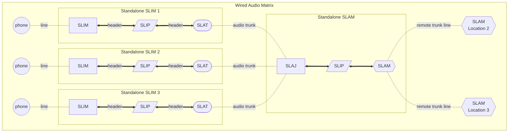
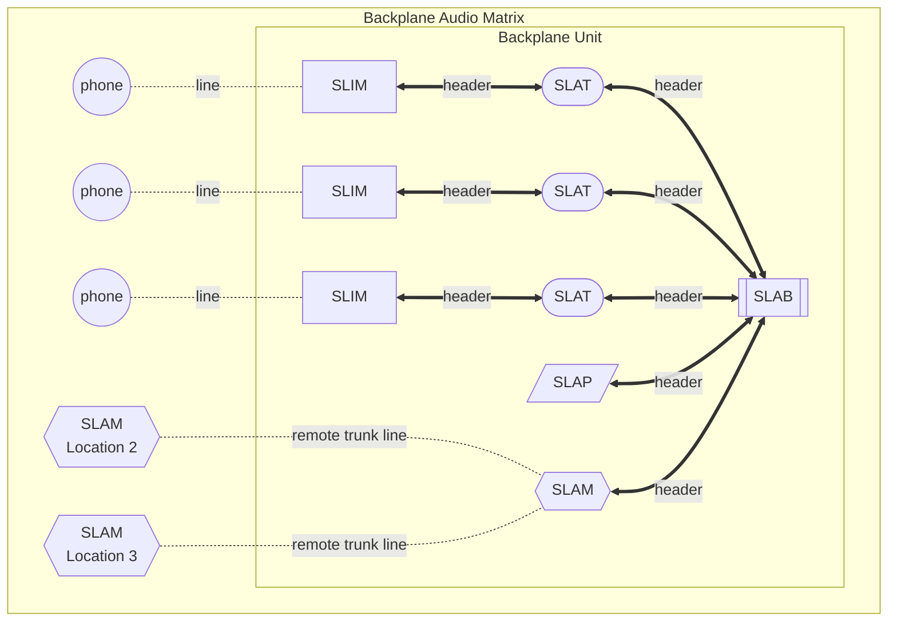

# module idea

|Acronym|Term|Headers|Description|
|---|---|---|---|
|SLIM|Subscriber Line Interface Module|1 Male|Drives one phone|
|SLIP|Subscriber Line Interface Power|1 Male, 1 Female|Power module for one SLIM|
|SLAT|Subscriber Line Audio Trunk|1 Male, 1 Female|Wired audio for one SLIM; has 600 ohm transformer, RJ11 jack, surge protection and jumpers or switches for selecting which header pins tie to audio if using backplane|
|SLAB|Subscriber Line Access Backplane|several Female|Backplane for multiple lines; tidy wiring, single chassis, single power supply|
|SLAM|Subscriber Line Access Module|1 Male|Audio switching matrix|
|SLAP|Subscriber Line Access Power|1 Male, 1 Female|Power module for entire backplane; beefier than SLIP; can be sandwiched between SLAM and SLAB or in separate slot|
|SLAJ|Subscriber Line Access Jacks|1 Female|Breakout of RJ11 jacks for standalone interconnect with standalone SLIMs if not using backplane|

>Modules with both male and female headers are able to be sandwiched between other modules. 

###Header Signals
|Signal|Comment|
|---|---|
|GND|multiple pins for extra current?|
|3.3V|multiple pins for extra current?|
|5V|multiple pins for extra current?|
|-5V|multiple pins for extra current?|
|A1+|
|A1-|omit if grounded audio works with matrix chip|
|A2+|
|A2-|omit if grounded audio works with matrix chip|
|A3+|
|A3-|omit if grounded audio works with matrix chip|
|A4+|
|A4-|omit if grounded audio works with matrix chip|
|A5+|
|A5-|omit if grounded audio works with matrix chip|
|A6+|
|A6-|omit if grounded audio works with matrix chip|
|A7+|
|A7-|omit if grounded audio works with matrix chip|
|A8+|
|A8-|omit if grounded audio works with matrix chip|
|I2C SDA|ideally multi-master mode to avoid polling SLIMs|
|I2C SCL|ideally multi-master mode to avoid polling SLIMs|
>Front panel display for backplane assembly possible with I2C bus