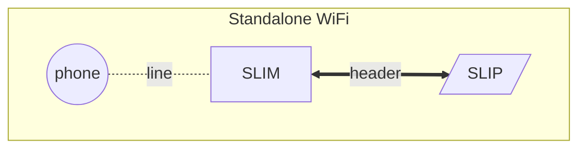
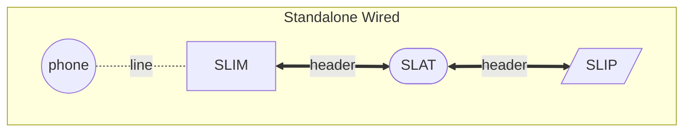
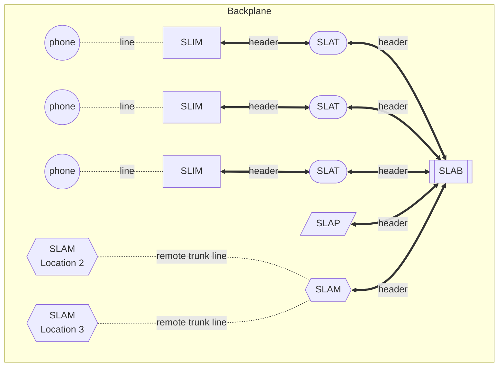

# module idea

|Acronym|Term|Description|
|---|---|---|
|SLIM|Subscriber Line Interface Module|Drives one phone|
|SLIP|Subscriber Line Interface Power|Power module for one SLIM|
|SLAT|Subscriber Line Audio Trunk|Wired audio for one SLIM|
|SLAB|Subscriber Line Access Backplane|Backplane for multiple lines|
|SLAM|Subscriber Line Access Module|Audio switching matrix|
|SLAP|Subscriber Line Access Power|Power module for entire backplane|

