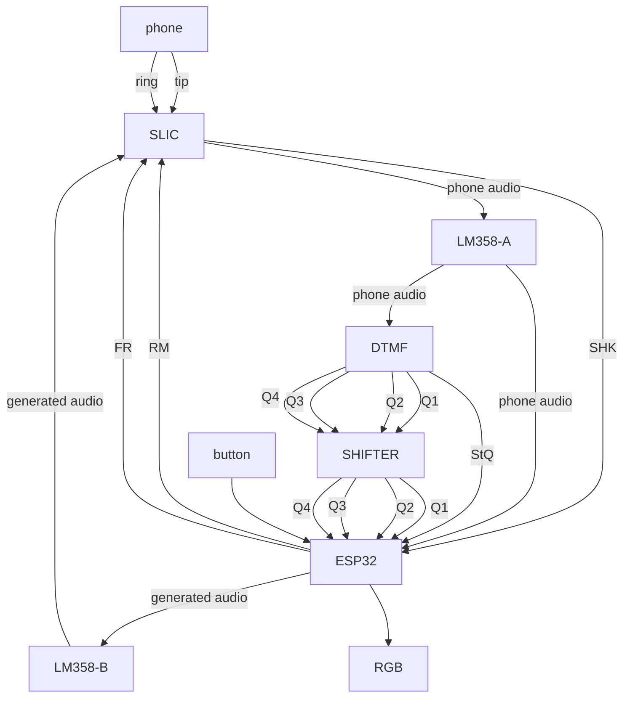

# high level module diagram

# pins
|Device|PIN|Mode|Purpose|
|---|---|---|---|
|ESP32|GPIO 12|pulldown|button simulating incoming call|
|ESP32|GPIO 2|output|onboard LED for off-hook status indication|
|ESP32|GPIO 27|pullup|SHK from SLIC for off-hook status notification|
|ESP32|GPIO 32|output|RM to SLIC to enable Ring Mode|
|ESP32|GPIO 33|output|FR to SLIC to toggle at ring frequency|
|ESP32|GPIO 14|ADC|audio from SLIC through op-amp and filters for detecting DTMF with sofware if enabled, and future digitizing of live audio|
|ESP32|GPIO 25|DAC|left channel generated audio to SLIC through op-amp|
|ESP32|GPIO 26|DAC|right channel generated audio (unused)|
|ESP32|GPIO 36|input|Q1 from DTMF module through level shifter|
|ESP32|GPIO 39|input|Q2 from DTMF module through level shifter|
|ESP32|GPIO 34|input|Q3 from DTMF module through level shifter|
|ESP32|GPIO 35|input|Q4 from DTMF module through level shifter|
|ESP32|GPIO 13|input|StQ from DTMF module (in range but should shift for safety)|
|ESP32|GPIO 21|output|addressable RGB|
